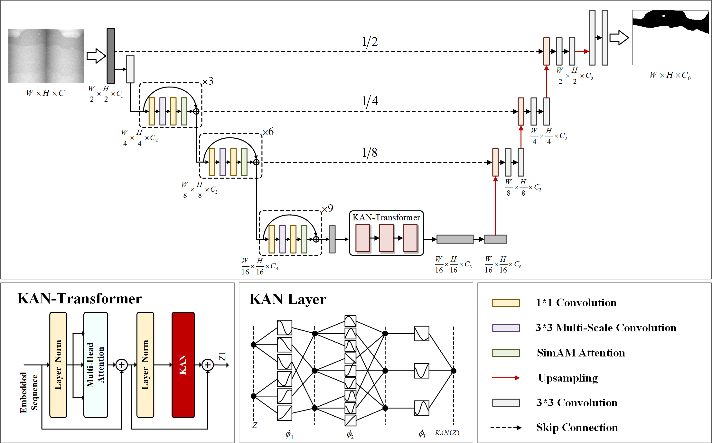
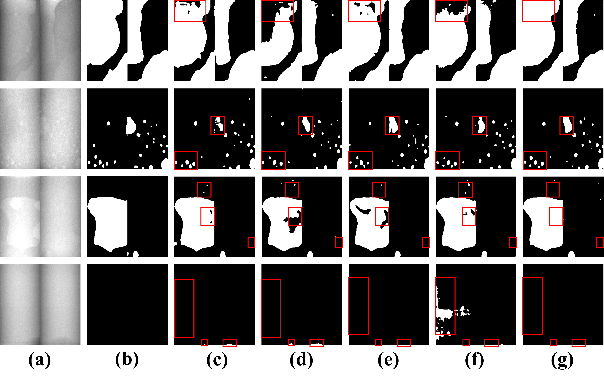

## Enhanced Defect Segmentation in X-ray Images of Copper Pipe Welds via Multi-scale Representation and Kolmogorov-Arnold Networks
This is the implementation of our paper "Enhanced Defect Segmentation in X-ray Images of Copper Pipe Welds via Multi-scale Representation and Kolmogorov-Arnold Networks"

<p align="middle">
    
</p>

## Usage

### 1. Prepare data

Please go to ["./datasets/README.md"](datasets/README.md) for details, or use the [preprocessed data](https://drive.google.com/drive/folders/1ACJEoTp-uqfFJ73qS3eUObQh52nGuzCd?usp=sharing) for research purposes.

### 2. Environment

Please prepare an environment with python=3.9, and then use the command "pip install -r requirements.txt" for the dependencies.

### 3. Train/Test

- Run the train script on synapse dataset. The batch size can be reduced to 12 or 6 to save memory (please also decrease the base_lr linearly), and both can reach similar performance.

```bash
CUDA_VISIBLE_DEVICES=0 python train.py --dataset Synapse --vit_name R50-ViT-B_16
```

- Run the test script on synapse dataset. It supports testing for both 2D images and 3D volumes.

```bash
python test.py --dataset Synapse --vit_name R50-ViT-B_16
```
## Visualization
<p align="middle">
    
</p>
. (a) Original X-ray image. (b) Ground-truth. (c): TransUNet. (d): UNet. (e): PSPNet. (f): SegNet. (g) Ours.

## Reference
* [TransUNet](https://github.com/Beckschen/TransUNet)
* [Kolmogorov-arnold networks](https://github.com/KindXiaoming/pykan)
* [segmentation_models.pytorch](https://github.com/qubvel/segmentation_models.pytorch)
